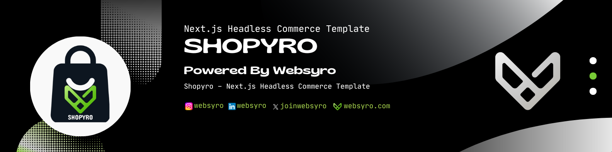
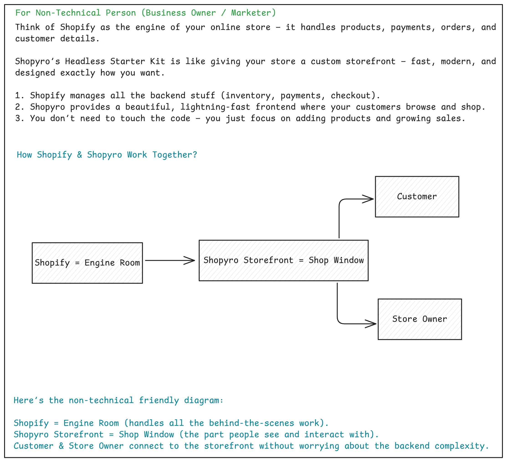
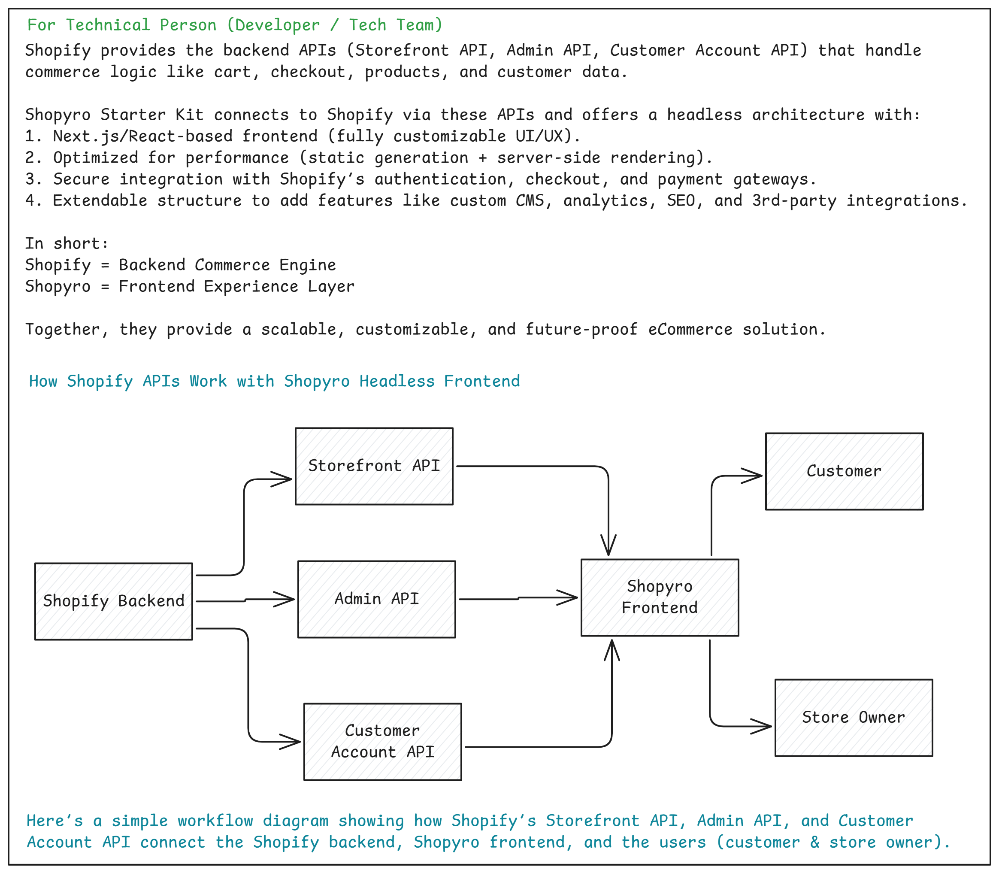

# Shopyro - Next.js Headless Commerce Template

[](https://nextjs.org/)
[](https://www.typescriptlang.org/)
[](https://tailwindcss.com/)
[](https://ui.shadcn.com/)
[](https://graphql.org/)
[](https://shopify.com/)
[](https://vercel.com/)
[](LICENSE)
[](https://pnpm.io/)



📌**Note**: Shopyro is an independent project by Websyro. It is not affiliated with, endorsed by, or sponsored by Shopify Inc. “Shopify” is a trademark of Shopify Inc.

## 🚀 Live Demo & Resources

- **Landing Page**: [shopyro.websyro.com](https://shopyro.websyro.com)
- **Demo Store**: [shopyrodemo.websyro.com](https://shopyrodemo.websyro.com)
- **Documentation**: [websyro.com/docs/shopyro](https://www.websyro.com/docs/shopyro)
- **Blog**: [How a Shopify store works with Shopyro](https://www.websyro.com/blog/how-a-shopify-store-works-with-shopyro-headless-commerce-starter-kit)

Transform your Shopify store into a fast, modern headless e-commerce site with Next.js. Perfect for developers, tech-savvy entrepreneurs, or anyone wanting a custom, scalable, and responsive storefront.

## Features

- **Next.js + Shopify**: Headless storefront with modern architecture
- **Instant Product Updates**: Optional Shopify webhook integration for on-demand revalidation
- **Fully Customizable**: Static pages, banners, policies, and navigation are editable
- **Multi-Niche Ready**: Works for fashion, electronics, jewelry, home decor, and more
- **Vercel-Optimized**: Easy deployment with environment variables and hosted URL configuration
- **Developer-Friendly**: Detailed setup instructions and pre-configured environment variables

## Core Features - Ready Out of the Box

✅ **Product browsing** (listing, filters, sorting, recommendations)  
✅ **Shopping cart** (add/update/remove, mini-cart, totals)  
✅ **Checkout** (Shopify-hosted, guest checkout)  
✅ **Basic search**  
✅ **Responsive UI/UX** (landing page, header, footer, branding)  
✅ **Static pages** (About, Contact, FAQ, Policies)  
✅ **SEO setup** (Meta, Open Graph, sitemap, robots.txt)

## How a Shopify Store Works with Shopyro Headless Commerce Starter Kit/Template?

Clearly explains how a Shopify store works with Shopyro Headless Commerce Starter Kit/Template, tailored for both technical and non-technical audiences.

### For Non-Technical Person (Business Owner / Marketer)



### For Technical Person (Developer / Tech Team)



## Quick Start

### Prerequisites

- Node.js 18+ and pnpm
- Shopify store (Basic plan or higher - Starter plan won't work)
- Vercel account (for deployment)

### 1. Clone and Install

```bash
git clone https://github.com/BCAPATHSHALA/SHOPYRO_LITE.git
cd SHOPYRO_LITE
pnpm install
```

### 2. Environment Setup

Create a `.env.local` file in the project root:

```env
# ===============================
# Environment Variables for Local Development
# ===============================

# Set the environment mode
NODE_ENV="development"

# Required: Public Shopify storefront domain
# Example: your-store.myshopify.com
NEXT_PUBLIC_SHOPIFY_STORE_DOMAIN="your-shopify-store-subdomain.myshopify.com"

# Optional: Storefront API token (recommended for production)
NEXT_PUBLIC_STOREFRONT_ACCESS_TOKEN="your-public-access-token"
SHOPIFY_STOREFRONT_ACCESS_TOKEN="your-public-access-token"

# Required: Secret key for secure on-demand revalidation
# Generate at: https://www.uuidgenerator.net/guid
NEXT_PUBLIC_SHOPIFY_REVALIDATION_SECRET="your-generated-random-uuid"

# Optional: Control Next.js telemetry
NEXT_TELEMETRY_DISABLED=0

# Required: Your site's hosted URL
NEXT_PUBLIC_SITE_URL="https://your-hosted-site.com"
```

### 3. Configure Shopify

#### Install Shopify Headless Theme

1. Download the [Shopify Headless Theme](https://github.com/instantcommerce/shopify-headless-theme)
2. Navigate to your Shopify admin → Themes
3. Click "Add theme" → "Upload zip file"
4. Activate the headless theme

#### Install Shopify Headless App

1. Go to your Shopify admin → Apps
2. Visit the Shopify App Store
3. Install the [Headless app](https://apps.shopify.com/headless)
4. Copy your Storefront API access token

### 4. Run Development Server

```bash
pnpm run dev
```

Visit [http://localhost:3000](http://localhost:3000) to see your store!

## Project Structure

```
shopyro/
├── app/                          # Next.js app directory
│   ├── about/                    # About page with components
│   ├── contact/                  # Contact page
│   ├── faq/                      # FAQ page
│   ├── privacy-policy/           # Privacy policy page
│   ├── terms-conditions/         # Terms & conditions page
│   ├── return-policy/            # Return policy page
│   ├── refund-policy/            # Refund policy page
│   ├── product/[handle]/         # Dynamic product pages
│   ├── sitemap.ts               # Dynamic sitemap generation
│   ├── robots.ts                # SEO robots.txt
│   └── globals.css              # Global styles
├── components/
│   ├── layout/                  # Header, footer, navigation
│   ├── product/                 # Product-related components
│   ├── cart/                    # Shopping cart components
│   ├── static-pages/            # Reusable page components
│   │   ├── atoms/               # Basic UI elements
│   │   ├── molecules/           # Component combinations
│   │   └── organisms/           # Complex components
│   └── ui/                      # shadcn/ui components
├── siteconfig/
│   ├── site.config.ts           # Global site configuration
│   ├── static-pages.config.ts   # Static page content
│   └── seo.config.ts            # SEO configuration
├── lib/                         # Utility functions
├── types/                       # TypeScript type definitions
└── public/                      # Static assets
```

## Customization

### Static Content

All static content is managed through configuration files in the `siteconfig/` directory:

- **`site.config.ts`**: Global site settings, navigation, footer links
- **`static-pages.config.ts`**: Content for About, Contact, FAQ, and policy pages
- **`seo.config.ts`**: SEO metadata and Open Graph settings

### Styling

- Built with **Tailwind CSS** for easy customization
- **shadcn/ui** components for consistent design system
- Responsive design with mobile-first approach
- Dark mode support (optional)

### Components

- **Atomic Design**: Components organized as atoms, molecules, and organisms
- **TypeScript**: Full type safety throughout the codebase
- **Reusable**: Modular components for easy maintenance

## Advanced Configuration

### Shopify Webhooks (Optional)

For instant product updates, configure webhooks in your Shopify admin:

1. Go to Settings → Notifications
2. Add webhooks for these events:

   - `collections/create`
   - `collections/delete`
   - `collections/update`
   - `products/create`
   - `products/delete`
   - `products/update`

3. Set webhook URL to: `https://your-domain.com/api/revalidate`

### Local Webhook Testing

Use ngrok for local webhook testing:

```bash
# Install ngrok
npm install -g ngrok

# Run your app
pnpm run dev

# In another terminal
ngrok http 3000

# Use the ngrok URL for webhook endpoints
```

## Deployment

### Deploy to Vercel

1. **Connect Repository**

   - Go to [Vercel](https://vercel.com/new)
   - Import your GitHub repository

2. **Set Environment Variables**

   - Add all environment variables from your `.env.local`
   - Set `NODE_ENV=production`
   - Update `NEXT_PUBLIC_SITE_URL` to your Vercel domain

3. **Deploy**

   - Click "Deploy" and wait for build completion
   - Your store will be live at your Vercel URL

4. **Custom Domain (Optional)**
   - Add your custom domain in Vercel dashboard
   - Configure DNS settings as instructed
   - SSL certificate is automatically provisioned

## Performance

- **Lighthouse Score**: 95+ on all metrics
- **Core Web Vitals**: Optimized for excellent user experience
- **Image Optimization**: Automatic WebP conversion and lazy loading
- **Edge Caching**: Global CDN with intelligent caching strategies
- **Bundle Size**: Optimized with tree shaking and code splitting

## Tech Stack

- **Framework**: Next.js 15+ with App Router
- **Language**: TypeScript
- **Styling**: Tailwind CSS
- **UI Components**: shadcn/ui
- **E-commerce**: Shopify Storefront API
- **Deployment**: Vercel
- **Package Manager**: pnpm

## **💎 Support & services**: [Shopyro](https://shopyro.websyro.com)

### Support Tiers

| Tier          | Benefits                                          |
| ------------- | ------------------------------------------------- |
| 🆓 **Free**   | Full template access + documentation (DIY setup)  |
| 🥉 **Bronze** | Shopify setup + Vercel deployment assistance      |
| 🥈 **Silver** | Custom design + ongoing support + webhooks setup  |
| 🥇 **Gold**   | Priority support + custom features + consultation |

### Services We Provide

✅ **Shopify + Next.js headless setup**  
✅ **Vercel deployment & environment configuration**  
✅ **Custom static pages & content updates**  
✅ **Frontend redesign for niche stores**  
✅ **Webhooks + instant revalidation setup**  
✅ **Ongoing support & consultation**

## 🤝 Contributing

We welcome contributions! Please see our [Contributing Guide](CONTRIBUTING.md) for details.

1. Fork the repository
2. Create your feature branch (`git checkout -b feature/amazing-feature`)
3. Commit your changes (`git commit -m 'Add amazing feature'`)
4. Push to the branch (`git push origin feature/amazing-feature`)
5. Open a Pull Request

## 📄 License

This project is licensed under the Shopyro Commercial License - see the [LICENSE](LICENSE) file for details.

## Acknowledgments

- [Next.js](https://nextjs.org/) for the amazing React framework
- [Shopify](https://shopify.dev/) for the powerful e-commerce platform
- [Vercel](https://vercel.com/) for seamless deployment and hosting
- [Tailwind CSS](https://tailwindcss.com/) for the utility-first CSS framework
- [shadcn/ui](https://ui.shadcn.com/) for beautiful, accessible components

## Support

- **Shopyro**: [Support](https://shopyro.websyro.com)
- **Email**: hello@websyro.com
- **LinkedIn**: [Follow Websyro](https://www.linkedin.com/company/websyro/)
- **Twitter**: [Follow Twitter](https://twitter.com/joinwebsyro)
- **GitHub**: [Report issues](https://github.com/BCAPATHSHALA/SHOPYRO_LITE/issues)
- **Documentation**: [Full docs & setup guide](https://websyro.com/docs/shopyro) for Vercel deployment and Shopify integration.

---

**Built with ❤️ by the Shopyro team**

Transform your e-commerce vision into reality with the power of headless commerce.
